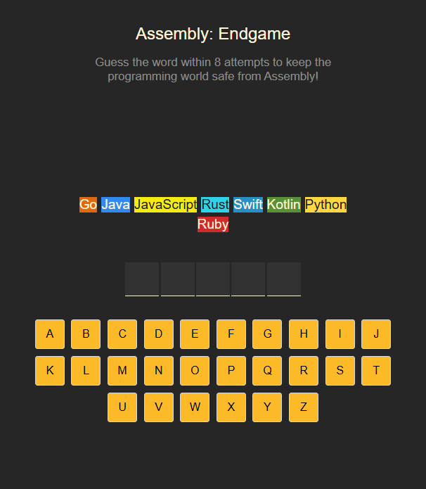
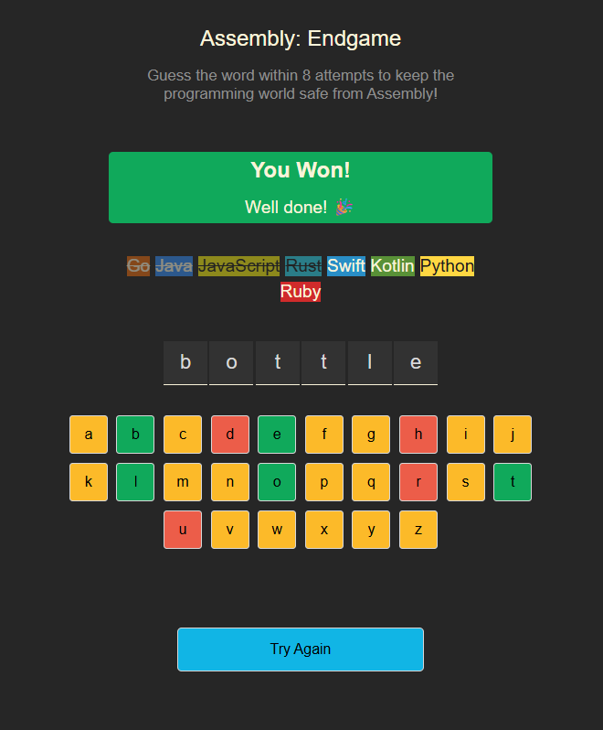
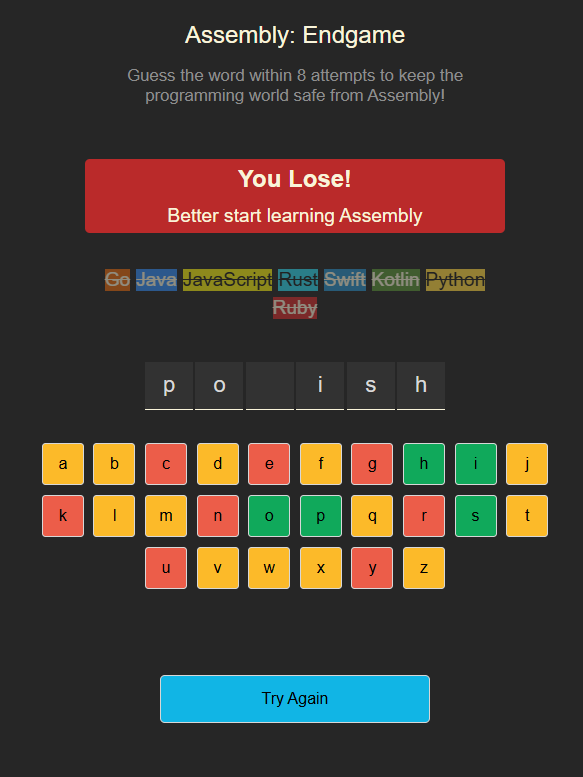

# 🕹️ Assembly: Endgame  

**Guess the word within 8 attempts to keep the programming world safe from Assembly!**  

---

## 📝 Functionality  

1. **Objective:**  
   - Guess the correct word within **8 attempts**.  
   - If you fail to guess correctly, a programming language gets marked as "lost".  
   - If all 8 attempts are exhausted without guessing correctly, **you lose the game**.  

2. **Gameplay:**  
   - The game displays a **set of letters as a keyboard**.  
   - Click on a letter to see if it is part of the word.  
   - Correct guesses reveal the letter in the hidden word.  
   - Incorrect guesses mark a programming language as **lost**.  

## 📸 Screenshot  
 
 
 
